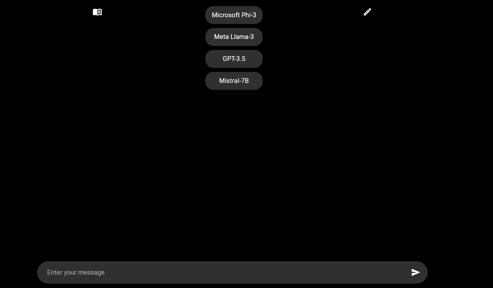
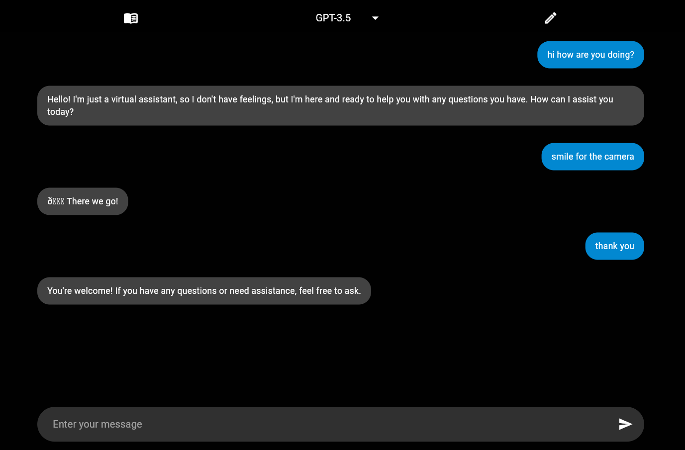
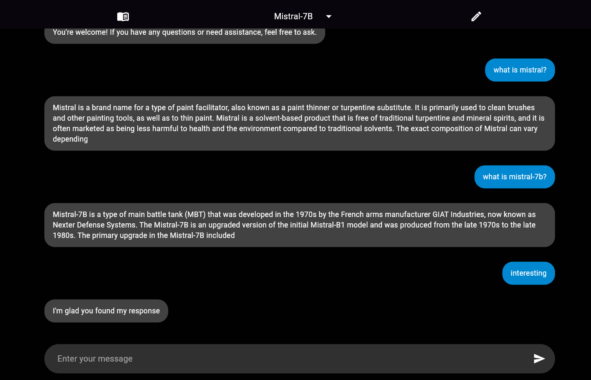
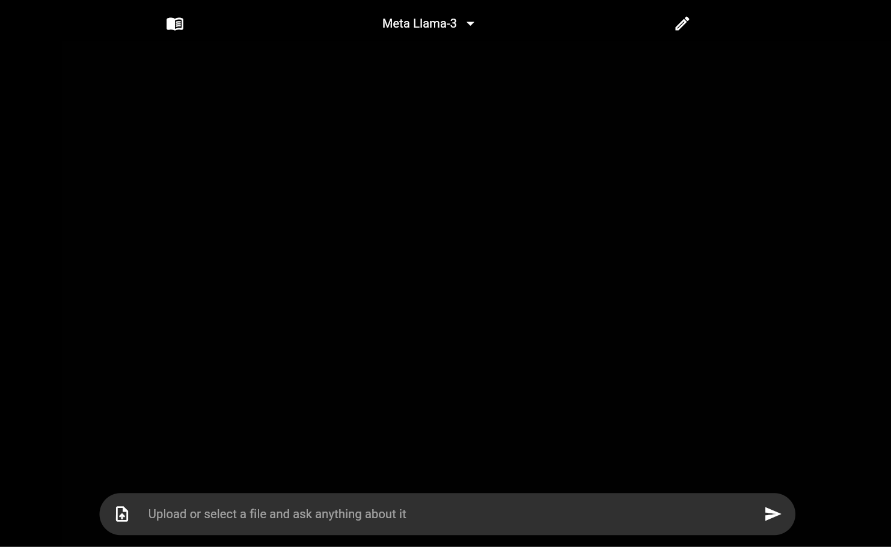
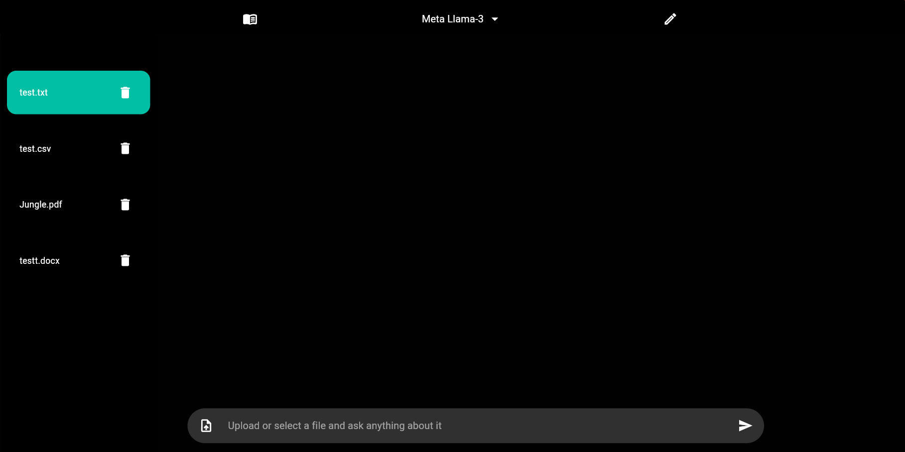
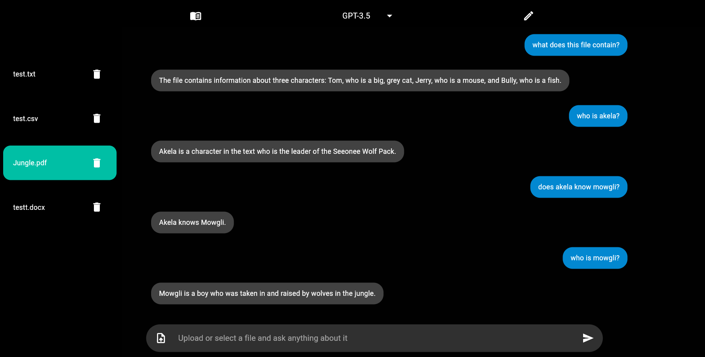

# Flutter LLM Chat & File Analysis Web App

Welcome to the ARMAAGPT! This is a project by ARMAA (ARMAA are the initials of my full name: Abdul-Rahman Moustafa Amin Ali) for the VNCR technical test. It is a web application that allows users to chat with Large Language Models (LLMs) or upload their files for analysis. The app integrates with a Python & Langchain API with 2 endpoints using FastAPI, the entire backend is containerized in a Docker container and deployed on Heroku to communicate with the LLMs, providing a seamless user experience for both chatting and file analysis.

## Features
- **LLMs available**: Microsoft Phi-3, Meta-Llama-3, GPT-3.5, Mistral-7B 
- **Chat with LLMs**: Users can interact with the LLMs by sending messages and receiving responses.
- **File Upload and Analysis**: Users can upload files (PDF, CSV, TXT, DOCX) and receive detailed analyses from the LLMs.

## Demo

For testing purposes, you can try the application using the following link: [Live Demo](https://armaagpt.web.app/).

> **Note**: The backend and frontend are hosted on low-end compute resources, which means the API may struggle to handle more than 5 requests per second. 

## Getting Started
### Prerequisites

- Flutter SDK: [Install Flutter](https://flutter.dev/docs/get-started/install)
- FastAPI: [Install FastAPI](https://fastapi.tiangolo.com/)
- Dart SDK
- Python 3.6+

ARMAAGPT/
├── Backend/
│   ├── chat_endpoint.py
│   ├── file_analysis_endpoint.py
│   ├── main.py
│   ├── Procfile
│   └── requirements.txt
│
├── Frontend/
│   ├── .dart_tool/
│   ├── .firebase/
│   ├── .idea/
│   ├── build/
│   ├── lib/
│   │   ├── chat.dart
│   │   ├── fileanalysis.dart
│   │   ├── home.dart
│   │   └── main.dart
│   ├── web/
│   └── screenshots/
│
└── README.md

### Usage

1. **Select a LLM Model**
   - Users can select the desired LLM from a dropdown menu.

2. **Chat with the LLM**
   - Navigate to the chat page, type your message, and send it to receive a response from the selected LLM.

3. **Upload and Analyze Files**
   - Navigate to the file analysis page, upload your files, a maximum of 5 files can be uploaded, (only 1 file can be uploaded at a time, however there can be a maximum of 5 files present in the interface) select whichever file you want and enter a prompt for analysis. The app supports PDF, CSV, TXT, and DOCX files.

### API Endpoints

The app communicates with the FastAPI backend via the following endpoints:

- **Chat Endpoint**
  - `POST /chat`
  - Request Body: `{ "model": "<model_name>", "prompt": "<user_message>" }`
  - Response: `{ "response": "<llm_response>" }`

- **File Analysis Endpoint**
  - `POST /file-analysis`
  - Request Body: Multipart form data including file and prompt.
  - Response: `{ "session_id": "<session_id>", "response": "<llm_response>" }`

### Contact

For any questions or feedback, please contact [abdulrahman8098@gmail.com](mailto:abdulrahman8098@gmail.com). \
Twitter [@itzARMAA](https://twitter.com/ItzARMAA)
---
